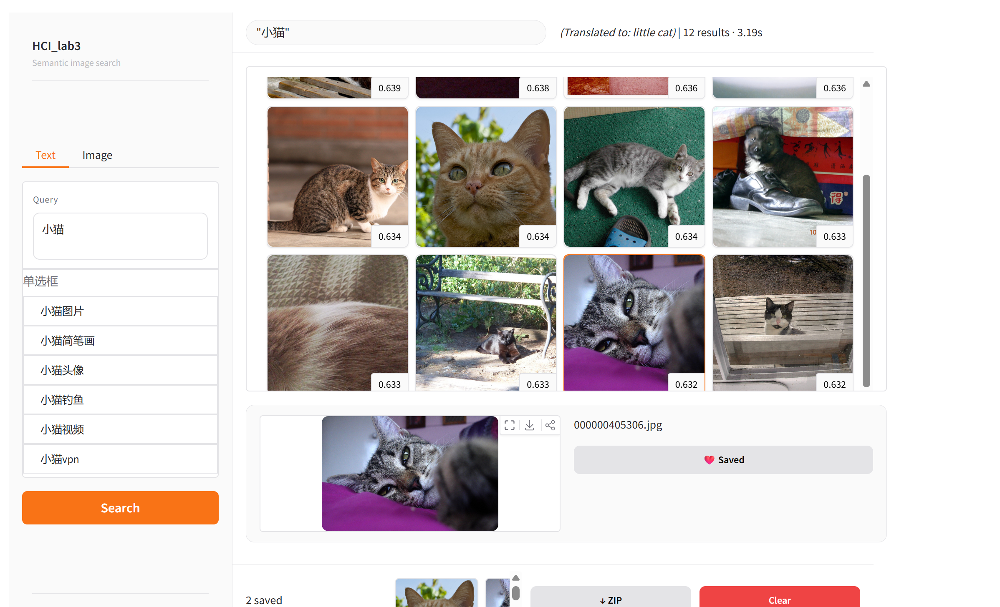
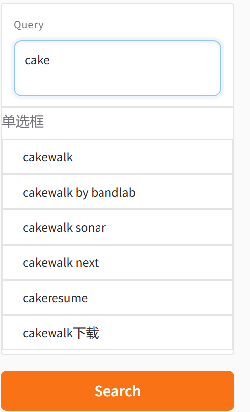
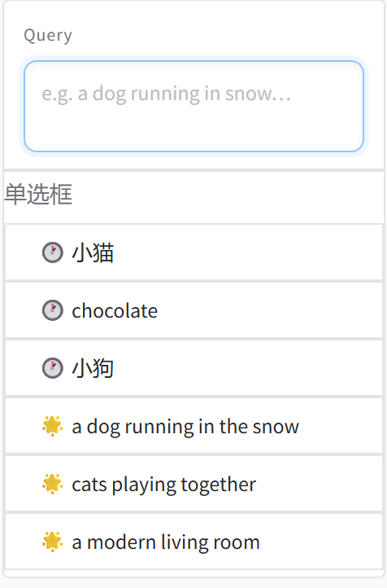
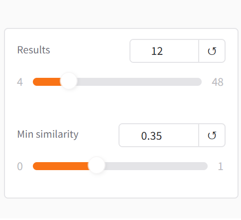
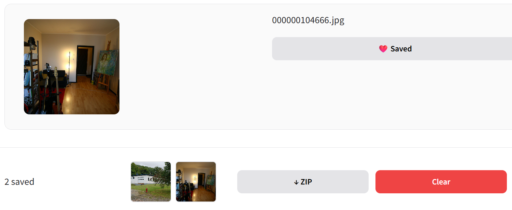
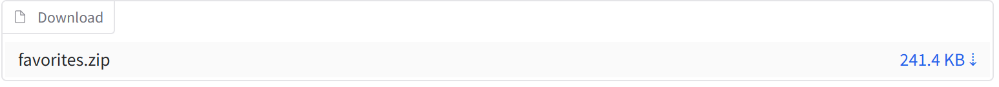
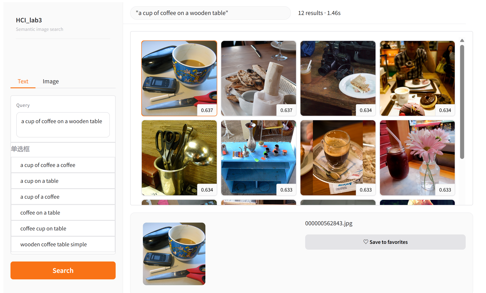
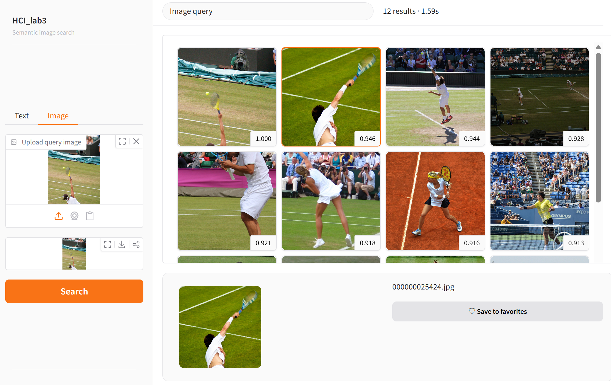

# 🔍 Five-Stage Visual Search System -- HCI_Lab3

这是一个严格基于 HCI (人机交互) 课程作业要求构建的 **五段式搜索框架** 构建的智能语义图像检索界面，底层由 CLIP 与 Upstash Vector DB 强力驱动。

## 🍰 目录结构 (Directory Structure)

```text
image_search/
├── assets/                     # 存放 README 展示用的界面截图
├── cache/                      # (可选) 存放本地的缓存文件或模型权重
├── data/                       # 存放本地小规模数据或抽样图片
│   └── subset/                 # 存放用于开发测试的子集数据
├── doc/                        # 文档目录
│   ├── CONCEPT.md              # HCI 设计理念与理论补充文档
│   └── Scoring_Criteria.md     # 课程原始作业说明与打分标准
├── src/                        # 核心源代码目录
│   ├── app.py                  # 🏆 核心：Gradio 前端界面与 HCI五段式设计实现
│   ├── search.py               # 封装 CLIP 文本/图像向量化与 Upstash 搜索逻辑
│   ├── encode_and_upload.py    # 最早期的特征提取尝试脚本 (本地 CPU执行)
│   ├── full_on_GPU.py          # 🚀 最终版特征提取与向量批量入库脚本 (云端 GPU执行)
│   └── prepare_subset.py       # 本地开发测试用的数据集子集准备脚本
├── pyproject.toml              # 项目依赖配置文件 (由 uv 管理)
└── README.md                   # 项目整体说明 (本文档)
```

---

## 🚀 执行工作流与架构设计 (Workflow & Architecture)

<div align="center">
  
</div>

### 1. 数据处理管道 (从 CPU 到 GPU 的演进)
本项目经历了真实且充满挑战的数据准备过程：
- **CPU 的坎坷：** 由于我的电脑没有GPU，开始我计划在CPU环境中对图像集进行编码 (`src/encode_and_upload.py`)。然而，针对数千张图像运行 **CLIP ViT-B/32** 模型的计算量极大，CPU运行速度慢，负载大，于是本地只进行流程跑通的冒烟测试。
- **GPU 云端提速：** 为了保障性能并构建充实的向量特征库，**整个向量化管道被果断迁移至 Kaggle 的 GPU 环境中执行**。我们编写了 `src/full_on_GPU.py` 并在 Kaggle 的 Server (搭载双 T4 GPU) 上直接运行。
- **最终成果：** 借助 GPU 的算力，我们在极短时间内成功下载、编码并向云端 Serverless 向量数据库 (Upstash Vector DB 512维度 Cosine Metric) 中推送了来自 `MS-COCO 2017 Validation` 数据集的 **5000+** 高质量图像特征点。

### 2. 检索架构 (Tech Stack)
- **底层模型库：** Python 3.12+ · `torch` · `clip` (OpenAI) · `Pillow`
- **特征编码：** 用户在前端界面输入文本或上传图片后，系统调用 `OpenAI CLIP` 将查询实时映射为高维度的特征向量。
- **搜索引擎：** 随后利用余弦相似度 (Cosine Similarity) 快速从远端 `Upstash Vector DB` 查询 Top-K 匹配结果。
- **用户交互前端：** `Gradio` —— 我们对其布局和事件刷新逻辑进行了深入且轻量化的定制（HTML按需插入注入，规避庞大的前端重绘），实现真正的极速响应反馈。

---

## 🎯 评分标准 (HCI Rubrics) 及其在界面上的对应实现

本项目在界面设计上完美打版了五段式搜索模型 (Five-Stage Search Framework) 的各项设计要求，并在附加体验上做了**创新**。以下为核心功能点及功能截图说明：

### I. Formulation（表达阶段 - 2分）
* **支持文本与图像搜索 (1分)：** 左侧任务栏提供了专门的 Tabs，分离并支持「Text 文本描述」与「Image 图像上传」作为查询入口。
* **搜索意图预览与确认 (1分)：** 我们特意配置了实时显式的 Preview 反馈。例如图像检索模式下，会在左侧立即展示图像缩略图确认（该展示在下面的全局结果中可以看出）。
* **语义联想与搜索历史（附加）：** 当我们在文本输入框中输入时，系统会自动调用 Bing Autocomplete API 提供动态的联想短语推荐（如上图左侧的下拉提示），同时保留了搜索历史界面（图中带时钟图标），当敲击文本框时自动提供辅助输入，极大减轻用户的记忆负担。
* **中文/英文支持查询（附加）：** 原始CLIP模型虽然是英文训练的，但我们通过引入 `googletrans` 库实现了输入文本的自动翻译功能，使得用户可以直接使用中文进行搜索，极大提升了系统的可用性和亲和力。
* *🌟 (语义联想推荐 / 搜索历史)：*
  <div style="display: flex; gap: 10px; margin-top: 8px;">
    
    
  </div>

### II. Initiation & Review（发起与审查阶段 - 2分）
* **一键发起 (1分)：** 搜索功能由高度显著的橘色🟠按钮 **“Search”** 承接。同时文本模式默认吸附了键盘 `Enter` 的潜意识发起。
* **全局结果概览 (1分)：** 
  <br>
  <br>所有有效检索都会在图库顶部用严谨的面板精确反馈，如：**Found 12 results · Query time: 0.45s**。

### III. Refinement（调整与求精阶段 - 1分）
* **动态参数控制 (Dynamic Slider - 1分)：** 
  <br>
  <br>我们在左下角设置了无阻塞式 (Non-blocking) 的参数调优机制。用户可以直接滑动 `Top-K（最大返回数）` 以及 `Min similarity（最小相似阈值）`。**随着滑块松开，当前界面的图库会自动刷新结果和个数，根本不需要用户去复点原先的 Search 按钮！**

### IV. Use（利用与操作阶段 - 1分）
* **收藏与本地下载 (1分) 及 选中预览：** 
  <br>
  <br>除了查看，用户点击某一张图片后会在下方浮现单张图的详细内容（**预览细节** + 图片名称），并可直接点击 `♡ Save to favorites` 按钮。
  <br>
  <br>当选为 `❤️ Saved` 后，图片会即时流向底部的 Favorites 收藏托盘。用户随后可一键点击 `↓ ZIP`，系统会自动将分散的网络图合并压缩包下载入本地硬盘。

### V. 核心检索能力呈现（5分）
* **以文搜图 (Text-to-Image - 2分)：** 准确理解长短句语义获取结果。上图展示了输入文本「a cup of coffee on a wooden table」后，系统成功召回了包含咖啡杯的图片，并且氛围和色调都非常匹配。
<br>
* **以图搜图 (Image-to-Image - 2分)：** 上传一张打网球的图片后，系统成功返回了多张包含网球运动元素的图片，且相似度较高。
  <br>
  <br>
* **结果实用性机制 (1分)：** 前述完整闭环的暂存托盘 (Tray) 和 ZIP 并发下载流程已经完美应对本条。

---

## 💻 本地运行指南

### 1. 配置基础环境
本项目使用极速的 `uv` 工具进行轻量级依赖管理，系统推荐 Python 3.10 ~ 3.12 运行环境：
```bash
# 同步并安装所有构建依赖
uv sync
```

### 2. 配置云端向量库凭证
由于系统的存储端基于 Upstash 向量云服务，请在项目根目录下新建一个 `.env` 文件，并填入您的专属调用凭证：
```env
UPSTASH_VECTOR_REST_URL=https://您的_upstash_url.upstash.io
UPSTASH_VECTOR_REST_TOKEN=您的_upstash_token
```

> ⚠️ **数据预热提示**：进行检索前，需要确保向量库中已有可调用的 CLIP 特征向量。推荐将 `src/full_on_GPU.py` 脚本上传至 Kaggle / Colab 等搭载 GPU 的数据科学环境中执行入库（实操时请依具体 Jupyter 环境进行依赖微调或补全挂载）。

### 3. 启动交互应用
配置完毕后，在终端运行核心引擎：
```bash
uv run python src/app.py
```
> 💡 **代理冲突排查**：若您的电脑开启了系统级网络代理（如 Clash / V2ray 等）导致 Gradio `localhost` 端口映射失败卡死，请使用此命令临时绕过本地代理：
> `NO_PROXY="localhost,127.0.0.1,::1" uv run python src/app.py`

当控制台成功给出 Local URL 挂载点时，在任意浏览器中打开 **`http://localhost:7860`** 即可沉浸式开启视觉检索体验！
